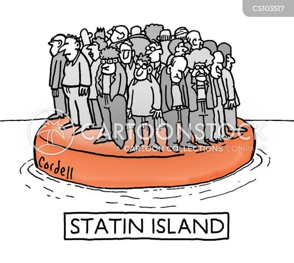
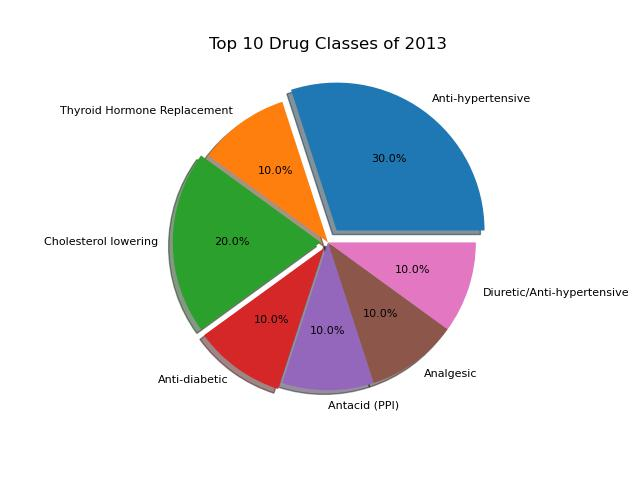
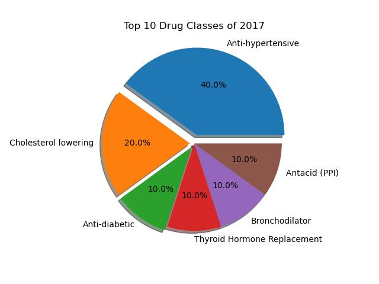
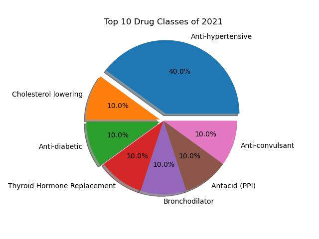
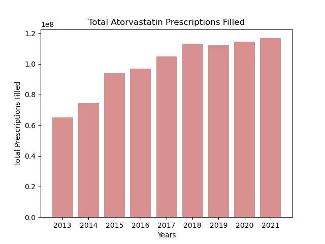
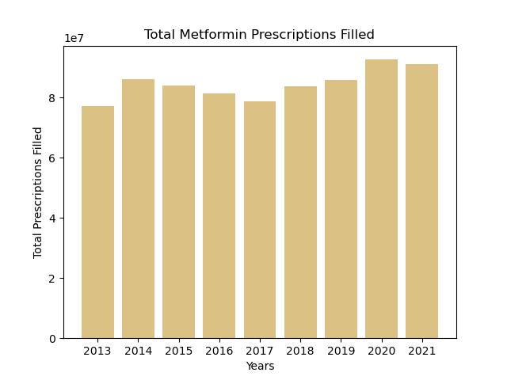
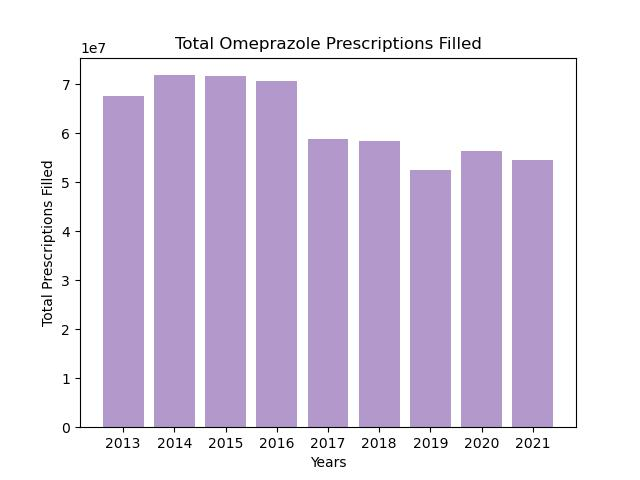
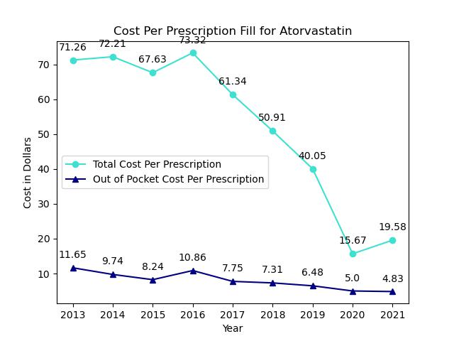
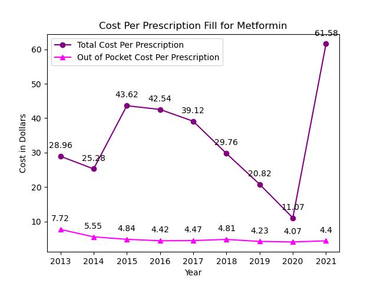
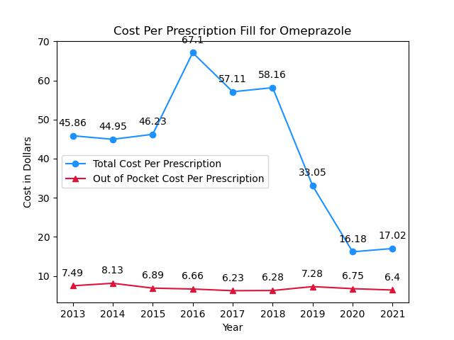

# CU_Project_1
Columbia University Bootcamp Project 1

The figures used for the analysis have been created through Jupyter Notebook using the Python coding languange and other libraries.

The code for the figures is named Drugs.py.ipynb in the respository.

# Welcome to the Wonderful World of Prescription Drugs! 

<ul>
    <li>Prescription medications have become a mainstream tool in the treatment of various health conditions in diverse patient demographics.</li>
    <li>More than 131 million people, about 66% of all adults in the United States, use prescription medications.</li>
    <li>The great majority of adults who have one of five common chronic conditions (diabetes, heart disease, hypertension, arthritis, and cancer) use prescription medications.</li>
</ul>

## What types of Medications are Commonly Filled?

There are many medications used to treat various conditions.
More than one medication can treat high blood pressure, high cholesterol, high blood sugar, acid reflux, etc..  Drug classes separate the many medications on the market based on their use, composition, and how they work inside the body to have their effect.

**Fun Facts # 1**

<ul>
    <li>Many medications in a similar drug class have the same suffixes.
        <ul>
            <li>Medications ending with "-statin" are used to treat high cholesterol.</li>
            

            
            

            <li>Medications ending with "-pril" are used to treat high blood pressure.</li>
            <li>Medications ending with "-prazole" are used to treat acid reflux.</li>
        </ul>
    </li>
</ul>

Data for the top 200 prescription medications filled from 2013-2021 has been filtered to show only the top 10 drugs that have been filled each year.  These medications are the primary focus for the illustrated data to come.

The following graphics show the top 10 medication classes that were filled in 2013 based on the top 10 drugs that were commonly filled that year. 

    
    
    

Since only data for top 200 prescriptions filled for years 2013-2021 were available, the pie charts are used to show the trend of what drug classes have been commonly filled at the start, middle, and end of the available years.

A common drug class that has been filled through out the years include medications used to treat high blood pressure (anti-hypertensive), high cholesterol, and high blood sugar (anti-diabetic).  These medication classes are important to conider when looking at these charts because these three classes are used to prevent heart failure.

Since 2013, at least 60% of the top medications filled have been used to treat conditions that could potentially lead to heart failure if not kept in check.

It may seem that the numbers are similar in each pie chart, but this shows a more troubling issue in that most people in the United States that use prescription medications are using them to prevent heart failure; to treat medical conditions that may have negative effects on the heart if not treated properly.

Based on the Centers for Disease Control and Prevention (CDC), heart disease is the leading cause of death for men, women, and most racial/ethnic groups in the United States.  About 660,000 people in the U.S. die from heart disease every year.  With how serious heart disease is, and the urgency of preventing this condition, it is no surprise that the most common drug classes that have been filled over the years have been medications used to treat conditions that can effect the heart.

## How many prescriptions have been filled over the years?

The previous pie charts indicate that the most consistent type of medication filled through the years include drugs that treat high cholesterol.  Atorvastatin is a cholesterol medication that has been in the top 10 medications filled since 2013.

    

As illustrated in the bar graph above, the number of Atorvastatin prescriptions over the years has increased.  The amount of Atorvastatin prescriptions filled in 2013 is about 65,000,000, and by 2021 that number increases to about 116,000,000.

Since 2017, Atorvastatin has exceeded 100,000,000 in total prescriptions filled, and that amount is only expected to grow.

An unfortuante fact about prescription medications is that these drugs are not meant to cure these health conditions, but they help in treating various symptoms that can arise from these conditions and potentially prevent more severe diseases from developing.

**Fun Facts # 2**

<ul>
    <li>Patients may need Atorvastatin even if their cholesterol is normal.</li>
        <ul>
            <li>Atorvastatin is usally thought of as a cholesterol-lowering medication, but even if people are at risk of cardiovascular disease (heart disease) the medication can help decrease the risk of heart disease and events, like a heart attack, for high risk groups.</li>
            <li>Patients may have other conditions that could lead to heart disease besides high cholesterol, and even if they may be given medications to treat those other conditions, Atorvastatin can be given to further decrease the risk of heart disease.</li>
        </ul>
</ul>

The second fun fact can be used to explain why the number of Atorvastatin prescriptions have increased so much over the years.

Even though Atorvastatin is more commonly used to lower cholesterol, there is an additional reason to dispense the medication that could have led to the almost double amount of prescriptions filled for this medication in nine years.

    

The second bar graph above illustrates the amount of presciptions filled specifically for Metformin since 2013.  When looking at the amount of prescriptions that were filled for Metformin compared to those for Atorvastatin, a major difference is that Metformin has never reached the hundred millions.

Metformin has been one of the top 10 medications that has been filled for the nine years presented in the data, however Atorvastatin has always shown to have been dispensed more.

The primary reason that Metformin is dispensed to patients is to treat high blood sugar levels, which is a major factor that need to be taken care of to prevent a potential heart event.  It is no surprise that Atorvastatin and Metformin have some of the highest amounts of prescriptions filled through the years, making these two medications the top two medications filled in 2021 alone.

**Fun Facts # 3**

<ul>
    <li>Metformin may also have benefits for people who do not have diabetes or borderline high blood sugar levels.</li>
        <ul>
            <li>Metformin can improve fertility for some people who have trouble getting pregnant.  By reducing insulin levels, this allows for more egg release.</li>
            <li>Metformin can help treat obesity and obesity-related conditions, and can help people with obesity reduce their weight, even if they do not have diabetes.</li>
            <li>Metformin has shown to slow some tumor growth and stop certain tumors from forming, but it is not clear if metformin can stop cancer from developing in living people.</li>
        </ul>
</ul>

The third fun fact lists other reasons that Metformin may be dispensed to patients.  Even though its primary use is to treat diabetes, borderline high blood sugar levels, and hopefullly prevent heart conditions from forming, this are all valid reasons as to why doctors may still write for this medication so often.

Even though Metformin has not reaced the amount of prescriptions filled as Atorvastatin, it is clear that medications with multiple uses tend to see themselves at the height of the medications filled over the years.

When comparing the final years that data was availble for these medications, Atorvastatin and Metformin have increasingly strong numbers for their prescription counts.  Since the treatment of potential heart conditions has become one of the main focuses of healthcare professionals in various health related fields, the number of prescriptions filled for medications that can be used to prevent a heart event will most likely keep increasing.

<i><b>What about the other drug classes that have been filled through the years?</i></b>

To people that look passed the exploding pieces of the pie chart they will notice that one of the drug classes that has been filled since 2013 and continues to be a top class filled still in 2021 include antacids, more specifically an antacid called a Proton Pump Inhibitor (PPI).

The counts for the prescriptions filled for Omeprazole, a PPI antacid, have consistenly placed this medication as one of the top 10 filled since 2013.

    

All three bar graphs show a very high amount of prescriptions being filled for each respective medication, but Omeprazole has shown to steadily decrease the amount of prescriptions filled over the years.  This medication has not reached the hundred millions in prescriptions filled, unlike Atorvastatin, but it still has a high amount of patients picking this up over the years.

Omeprazole is not used to help treat a potential heart condition, and yet it is still a medication that finds itself in the top 10 that gets filled in high amounts since 2013.

This medication is commonly dispensed to treat acid reflux and GERD, which is a condition that can develop when there is access acid in the esophegus over time.

**Fun Facts # 4**

<ul>
    <li>Omeprazole starts to work within 2 to 3 days, but it may take up to 4 weeks for it to work fully.</li>
    <li>Weight gain has been reported in some poeple taking Omeprazole since the drug was approved.</li>
</ul>

Compared to the fun facts of the previous medications, Omeprazole seems to have some negative details that may lead to a decrease in it being dispensed to patients over time.

Acid reflux, and its worse form GERD, affect about 20% of adults and 10% of children in the United States, but may patients do not seek medical treatment for this.  When the symptoms get worse is when people decide to fill a prescription with something as powerful as Omeprazole to help treat the condition.

The goal of the pie charts was to show that even though there are some classes that are filled more commonly, this does not mean that other health conditions do not plaque a large amount of people.  Since medications like Omeprazole are effective in treating their primary condition, even with the longer time to show an effect and the possible side effects, they will continously be filled through the years to treat a condition that a one fifth of the population may have.

## How have the costs of medications changed over the years?​

A major factor that can contribute to the increase in prescriptions being filled for various medications is the cost of the medicine.  Most patients that use prescription medications for chronic conditions rarely pay full retail price for the medicine that they need to take every single month.

Many patients only fill certain prescriptions when they know the medication is only covered by their insurance.  During the times a medication may not be covered, patients will only pick up a prescription if the out of pocket cost is suitable for them.  However, when a patient has not been paying for a medication for months, and then suddenly the insurance stops paying, they are hesitant to pay any amount.

Private health insurances and those that are run by the state or federal government contribute to most of the coverage for prescription medications.

The following line graphs will indicate the cost of the prescriptions of the medications discussed above over the years.  Each line graph is going to show how two different types of costs have been effected since 2013.

The lines with a circle marker are the total average costs per prescription.  This indicates the average total cost of the specific medication including its out-of-pocket cost and any amount that is paid by other parties, which count for private insurance, Medicaid, Medicare, etc..    

The lines with the triangle marker are the out-of-pocket cost per prescription.  This indicates the average payment made by each patient that may include a deductible from the insurance, a copayment, or the cash price that could be paid without insurance coverage.  Discount cards are regularly available from doctors' offices and even pharmacies to bring down the cost of the medications for patients when insurance may not be a viable option.

    

It is always a positive sign when something that is used by a lot of people has its price reduced.  When looking at the costs per prescription filled for Atorvastatin, in 2013 the overall price of the medication has been the most expensive for the insurance companines and the patient themselves.

The total cost per prescription being as high as $71.26 in 2013 is a bittersweet statistic.  The price to be covered by insurances is $71.26, which is a lot for one prescription, but this shows that the insurance actually pays for the medication.  The insurances are paying enough so that the patient can potentially pay on average just $11.65 for one prescription of this medication.

The decrease in average total cost per prescription since 2013 shows that even though the insurance companies, or government funded programs, are covering less of the medication, but this does not mean the patient would pay more.  On average, the patient is still paying less for the medication even when the insurance stops paying as much as they did in years prior.  From 2020 to 2021, the total cost that the insurance companies would pay for is at its lowest, but when the insurance started to pay about $4 more in 2021, the patient still paid less, on average, for their medication.

    

Metformin shows a similar trend in total cost per prescription as Atorvastatin.  This medication is considered to be an affordable medication to treat high blood sugar, and the reason can be shown in this line graph.  Metformin has been a relatively cheaper medication over the years compared to Atorvastatin.  The patients pay less for the medication, on average, for their prescriptions, and over the years this medication has slowly been decreasing in price.  From 2014-2015, the data shows that insurance companies may have started to pay more for the medication compared to the earlier years, and until 2022 have been paying less.  Similarly to Atorvastatin, the insurance companies started paying less for the Metformin by 2020, however, the data shows a massive increase in coverage in 2021 for this medication.

When looking at the costs of an item, seeing a massive increase from one year to another would more often than not indicate a negative statistic, however, a good healthcare professional thinks of the patients first, which means the increase is a positive sign.  Even though this means that the medication has sky-rocketed in retail price in just one year, the brightside is that the insurance companies have been paying for this medication most of the time.  This can be another reason patients are actually filling this medication as it is primarily covered by their plans.

With the insurance companies or government funded programs pay for the medications, patients tend to pay less every time they need to pick up the medication.  In this case, seeing the average total cost per prescription increase can be considered the healthcare system doing something right, making necessary medications for patients more affordable.

    

The average total cost of Omeprazole has been shown to be greater than that of Metformin over the years, but has been slightly less than that of Atorvastatin.  With insurance companies and government programs paying for the medication, patients pay a relatively low and consistent price since 2013.  Omeprazole has similar increases in total cost during a few years, but does not have a drastic increase in coverage in 2021 as compared to how Metformin had.  

After 2016, the average total cost of prescriptions for Omeprazole have been decreasing, which means coverage for this medication has been decreasing for patients.  Outside of this data, it is important to know that insurance companies do not think patients should take this medication chronically, limiting coverage of about 3-6 months worth of the medication every year.  Some insurance companies and government programs pay for monthly fills of this medication, but now as much as those that do not.  Generally, if insurance does not pay for this medication, many pharmacy discount codes have shown to make the price of the medication a lot smaller than the retail price.

Prolonged use of Omeprazole is not recommended, but this does not mean that patients are going to stop taking this medication.  Even though less prescriptions are filled for Omeprazole every year, the price of the medcication has been decreasing as well.  As long as the medication is not too expensive, even without the most coverage from insurance, patients will still come to fill this medication.

When comparing the costs of all three medications, patients never paid on average more than $12 and have been capped at a price of not less than $4.  All of the line graphs indicate that patients do not pay an excessive amount for their medications, even though most patients are used to not paying anything for their medications, or at most $1, under government funded programs.  Generally when looking at the costs of anything, it is a good sign when prices decrease for consumers, however, seeing the total cost of prescriptions increasing can be considered a good sign for the patients.  The more the insurances pay for the medication, the less the patient has to pay for the medicine, not counting all the premiums they already pay for their insurance.  When coverage is active and when insurance does not pay for one of the discussed medications for any reason, the patients on average pay a very generous out-of-pocket cost for medications that they will most likely refill every month.

## References

<ul>
    <li>https://www.webmd.com/heart-disease/heart-failure/news/20240503/heart-failure-mortality-rate-continues-to-rise​</li>
    <li>https://clincalc.com/DrugStats/Top200Drugs.aspx​</li>
    <li>https://www.rwjf.org/en/insights/our-research/2019/02/medicaid-s-impact-on-health-care-access-outcomes-and-state-economies.html#:~:text=Of%20all%20types%20of%20health,and%20taxes%20paid%20as%20adults​</li>
    <li>https://www.health.harvard.edu/blog/why-do-your-prescription-drugs-cost-so-much-202401183007​</li>
    <li>https://www.cdc.gov/policy/polaris/healthtopics/heartdisease/index.html#:~:text=Heart%20disease%20costs%20the%20United,%2C%20medications%2C%20and%20premature%20death.​</li>
</ul>